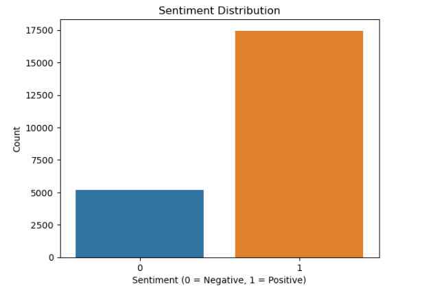
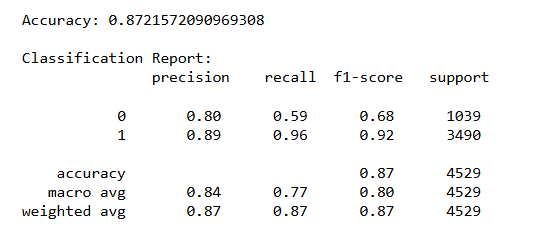
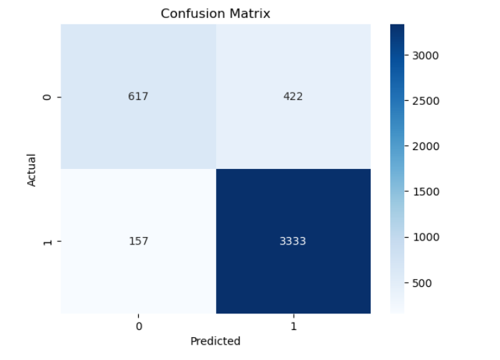

# Sentiment Analysis on Women's Clothing E-Commerce Reviews

## Project Overview

This project analyzes customer reviews from a women's clothing e-commerce website.

The goal is to classify customer reviews into two categories:

- Positive
- Negative

The project uses **TF-IDF** to convert review text into numerical features and **Logistic Regression** to predict the sentiment.

## Dataset

The project uses the **Women's Clothing E-Commerce Reviews** dataset.

The following columns are used:

- `Review Text` – The customer's written review
- `Rating` – The rating given by the customer

Rows with missing review text or rating are removed.

## How Sentiment is Created

The sentiment is created from the customer's rating:

- Rating **4 or 5** → Positive (`1`)
- Rating **1, 2, or 3** → Negative (`0`)

## Project Workflow

1. Load the dataset
2. Select Review Text and Rating
3. Remove missing values
4. Create the Sentiment column
5. Convert review text into numerical features using TF-IDF
6. Split the data into training and testing sets
7. Train a Logistic Regression model
8. Predict sentiment on the test data
9. Evaluate the model using accuracy, classification report, and confusion matrix

## Technologies Used

- Python
- Pandas
- Matplotlib
- Seaborn
- Scikit-learn

## Machine Learning Method

### TF-IDF

TF-IDF (Term Frequency-Inverse Document Frequency) is used to convert the review text into numerical values.

This allows the machine learning model to work with the text data.

The project uses:

- English stop-word removal
- Maximum of 5,000 features

### Logistic Regression

Logistic Regression is used as the classification algorithm.

The model learns from the training reviews and predicts whether new reviews are positive or negative.

## Train-Test Split

The dataset is divided into:

- **80% Training Data**
- **20% Testing Data**

The test data is used to evaluate how well the model performs on unseen reviews.

## Results

The Logistic Regression model achieved an accuracy of:

**87.21%**

### Classification Report

| Sentiment | Precision | Recall | F1-Score | Support |
|-----------|-----------|--------|----------|---------|
| Negative | 0.80 | 0.59 | 0.68 | 1039 |
| Positive | 0.89 | 0.96 | 0.92 | 3490 |
| **Overall Accuracy** | | | **0.87** | **4529** |

## Visualizations

### Sentiment Distribution

### Model Performance

### Confusion Matrix

## Key Observation

The model performs better at identifying positive reviews than negative reviews.

The positive class has a recall of **0.96**, while the negative class has a recall of **0.59**.

This is because the test data contains more positive reviews than negative reviews.

## Conclusion

This project demonstrates how Natural Language Processing and Machine Learning can be used to analyze customer reviews.

Through this project, I worked with:

- Text data preprocessing
- TF-IDF vectorization
- Logistic Regression
- Train-test splitting
- Model evaluation
- Confusion matrix

The final model achieved **87.21% accuracy** on the test data.
